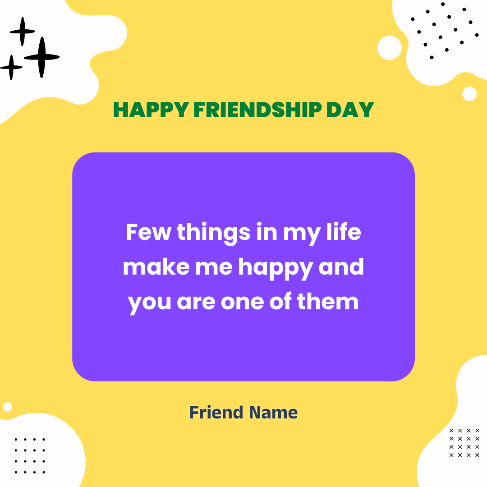

# 💛 Friendship Day Website 💛

Celebrate the joy of friendship with this colorful and heartfelt **Friendship Day card generator**. Express your love, appreciation, and warmth to your friends through beautifully designed messages and visuals.

## 🌐 Live Site

👉 [Visit the Friendship Day Site](https://friendship-day01.netlify.app)

---

## 📸 Sample Preview

Here’s a sneak peek of the card design:



---

## 🎯 Features

- 🌟 Stylish and colorful card design  
- 💬 Personalized message area  
- 🧡 Perfect for sharing warm wishes on Friendship Day  
- 🎨 Clean and responsive layout  
- 🔗 Hosted live on Netlify

---

## 🚀 Getting Started

### 1. Clone the Repository
```bash
git clone https://github.com/divyam007142/Friendship-day.git
cd Friendship-day
````

### 2. Install Dependencies

```bash
npm install
```

### 3. Start the Development Server

```bash
npm run dev
```

---

## 🛠️ Tech Stack

* HTML
* CSS
* JavaScript
* [Vite](https://vitejs.dev)
* Netlify (for hosting)

---

## 🙌 Credits

Developed with 💖 by **Divyam Singh**

> "Few things in life make me happy, and you are one of them." — Happy Friendship Day!

---

## 📬 Feedback

If you have any suggestions or feedback, feel free to open an issue or connect on [Discord](https://discord.gg/UPCore).

```

---

### ✅ What You Should Do:
1. Save your image file as `Sample.png` inside `src/assets/`.
2. Commit and push your updated `README.md` to your GitHub repo.

Let me know if you want to allow card downloads or user name input in the card!
```
